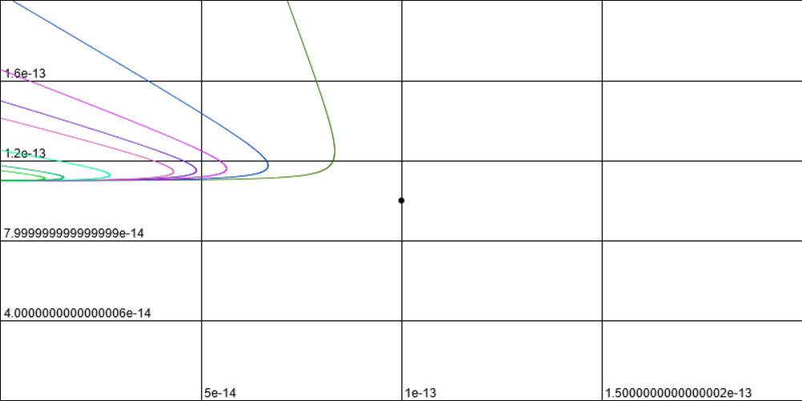
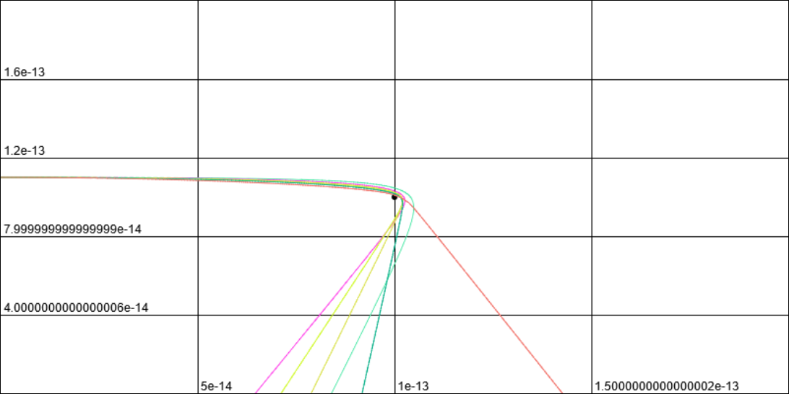
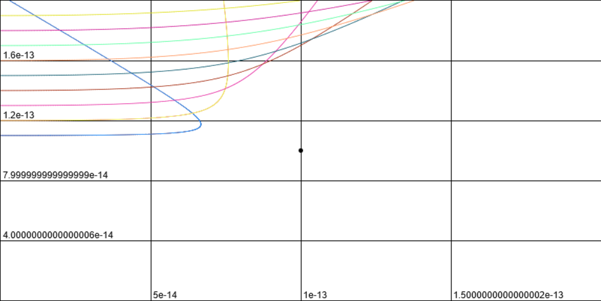
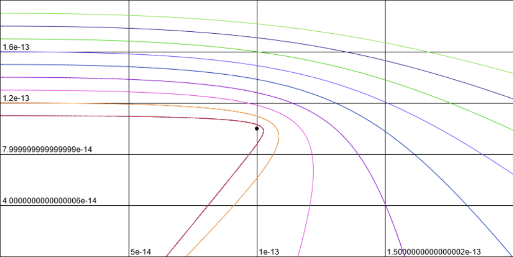
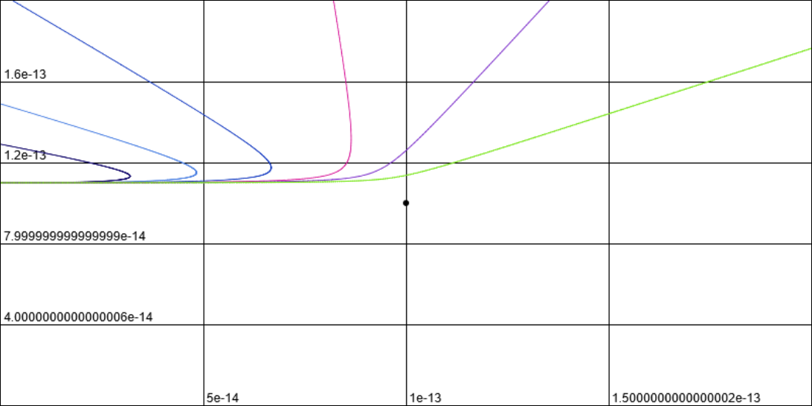
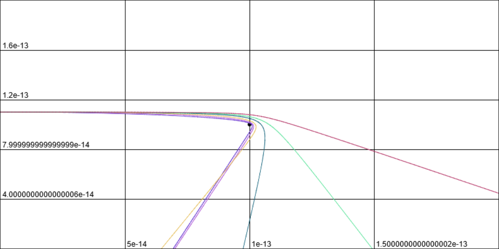
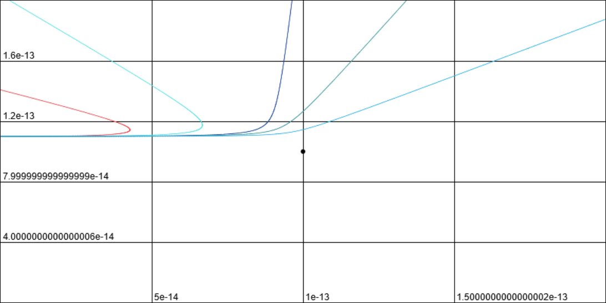
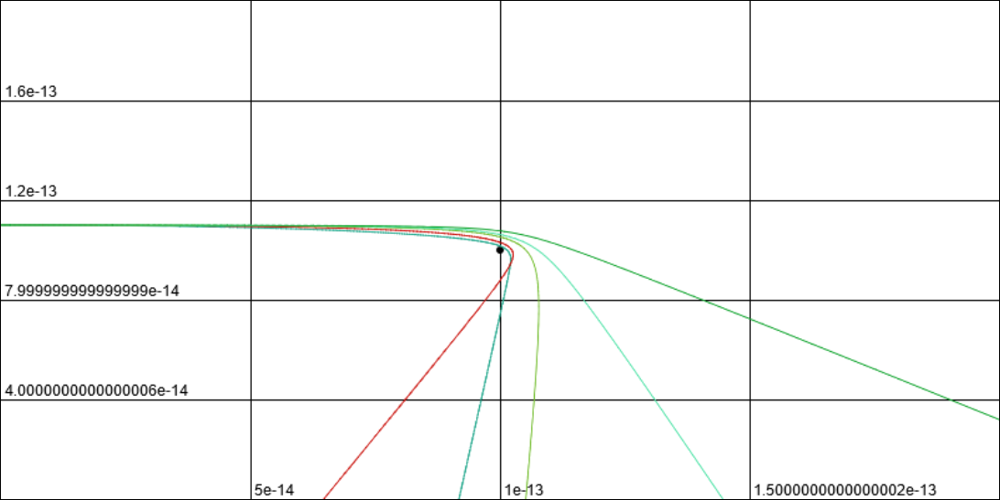
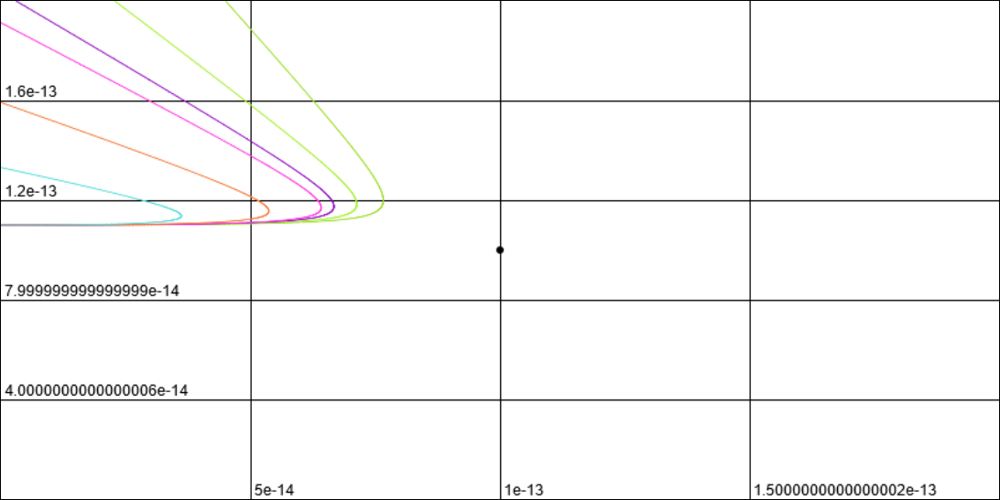
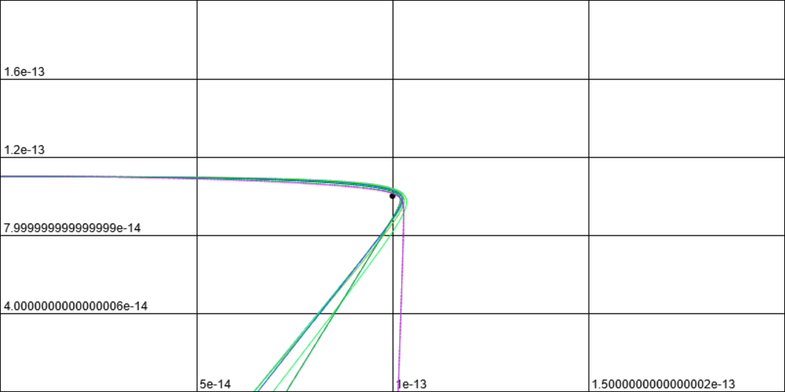

# Отчёт 
#### Моделирование опытов Резерфорда по рассеиванию альфа-частиц
Все действия происходят в `main.js`, будем обращаться к нему.

Задаём статичные переменные
```js
const static = {
    e: 1.6e-19, // заряд электрона
    dt: 1e-23, // шаг по времени
    e0: 8.85418781762039e-12, // электрическая постоянная
    pie: 2.7816251377400302e-11 // PI * e0
}

const gold = {
    y: 1e-13, // положение атома золота
    x: 1e-13, // - / -
    q: 79 * static.e, // заряд золота
}

const particle = {
    y: 1e-14 + 1e-13, // положение альфа-частицы
    x: 0, // - / -
    Ux: 1e7, // скорость альфа-частицы в проекциях
    Uy: 0, // - / -
    m: 6.642156264e-27, // масса
    q: 2 * static.e // заряд
}
```

Рекурсивная формула по dt
```js
function calcPositions(particle){
    let points = [{
        Ux: particle.Ux,
        Uy: particle.Uy,
        x: particle.x,
        y: particle.y
    }]; 

    for (let i = 1; isInArea(points[i - 1].x, points[i - 1].y); i++){
        points[i] = {
            Ux: points[i - 1].Ux + (gold.q * particle.q * (points[i - 1].x - gold.x) * static.dt) / 
            (4 * static.pie * particle.m * ((points[i - 1].x - gold.x) ** 2 + (points[i - 1].y - gold.y) ** 2) ** 1.5),
            Uy: points[i - 1].Uy + (gold.q * particle.q * (points[i - 1].y - gold.y) * static.dt) / 
            (4 * static.pie * particle.m * ((points[i - 1].x - gold.x) ** 2 + (points[i - 1].y - gold.y) ** 2) ** 1.5),
        }
        points[i].x = points[i - 1].x + (points[i - 1].Ux + points[i].Ux) * static.dt;
        points[i].y = points[i - 1].y + (points[i - 1].Uy + points[i].Uy) * static.dt;
    }
    return points;
}
```

Рисует график по координатам
```js
draw(...args)
```

### Зависимость от q с +q

### Зависимость от q с -q

### Зависимость от b с +q

### Зависимость от b с -q

### Зависимость от ux с +q

### Зависимость от ux с -q

### Зависимость от Q с +q

### Зависимость от Q с -q

### Зависимость от m с +q

### Зависимость от m с -q
