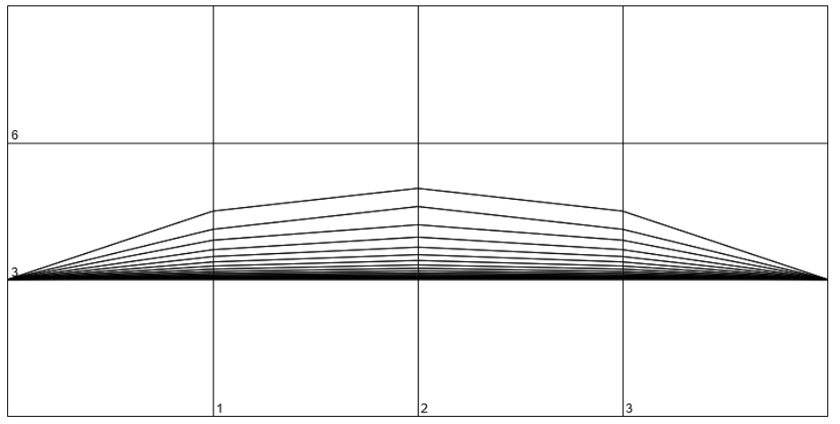
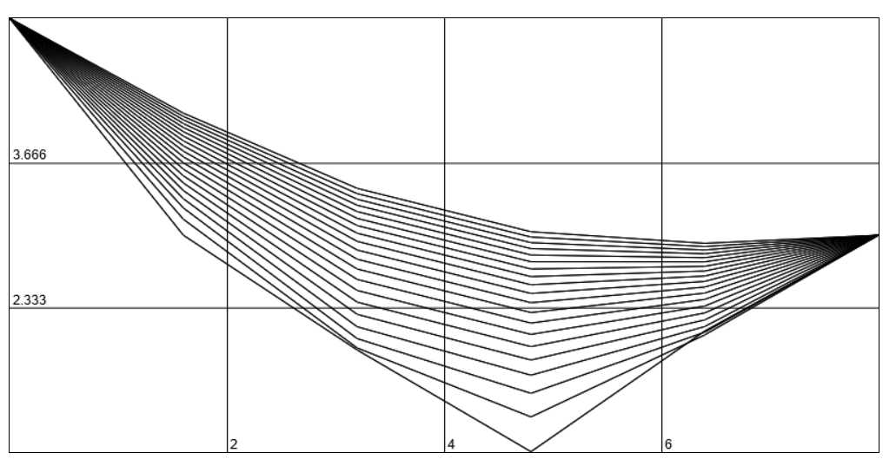

# Отчёт 
#### Распределения тепла в стержне
Все действия происходят в `main.js`, будем обращаться к нему.

Используемые переменные (пока что их нельзя менять)
```js
const dt = 0.8; // шаги по времени
const a = 0.7; // коэффициент теплопроводности
const len = 8; // длина стержня
const lengthIntervals = 5; // количество интервалов длины
const dx = len / lengthIntervals; // шаги по длине
const timeIntervals = 20; // количество интервалов времени
```

Считает температуру на первом временном интервале и на концах стержня
```js
/**
 * Get temperature on the x-coordinate.
 * Also uses to get temperature at the zero layer
 * @param {number} x - position on the rod
 * @return {number} temperature
 */
function getTemperatureAtTheEnds(x){
    if (x == 0) return 3;
    if (x == len) return 1;
    return Math.sin(x);
}
```

Считает температуру на всех остальных участках
```js
/**
 * @param {number} t - time
 * @param {number} x - position on the rod
 * @param {array[]}points - array of all prev points
 * @return {number} - temperature 
 */
function getTemperature(t, x, points) {
    return points[t - 1][x] + 
    (a ** 2 * dt / (dx ** 2)) * 
    (points[t - 1][x + 1] - 2 * points[t - 1][x] + points[t - 1][x - 1]);
}
```

Рисует график по координатам
```js
draw(...args)
```



