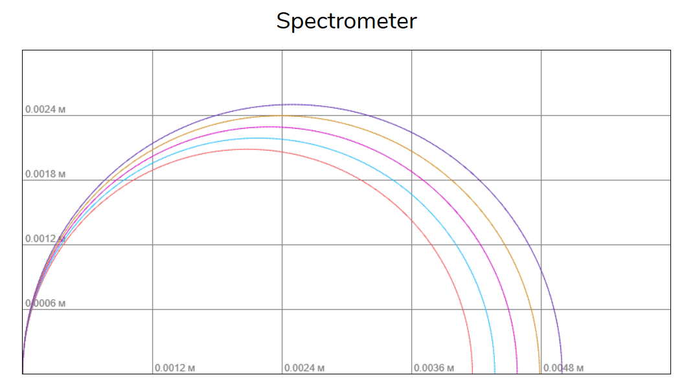

# Отчёт 
#### Спектрометер
Все действия происходят в `main.js`, будем обращаться к нему.

Задаём статичные переменные
```js
const aem = 1.66e-27; // Кг
const B = 0.1; // Тл
const dt= 10e-9; // интервал, по которому будем моделировать

const particle = {
    m: 20 * aem, // Кг
    q: 1.6e-19, // Кл
    ux: 0, // м/c
    uy: 1e3, // м/с,
    x: 0,
    y: 0,
}
```

Рекурсивная формула по dt
```js
// q, uy, ux, m - данные частицы
// dt, B - константы
const dux = q * uy * B * dt / m;
const duy = -q * ux * B * dt / m;

x += ux * dt;
y += uy * dt;

ux += dux;
uy += duy;

points.push([x, y]);
```

Далее считаем по рисуем графики для пяти частиц с различными массами
```js
for (let i = 20; i < 25; i++) {
    particle.m = i * aem;

    const points = calculatePoints(particle);

    drawLines(points, canvasParams);
}
```

Чем тяжелее, тем дальше частица летит по оси OX

### Получившиеся графики слева направо 20-24 a.e.m.
