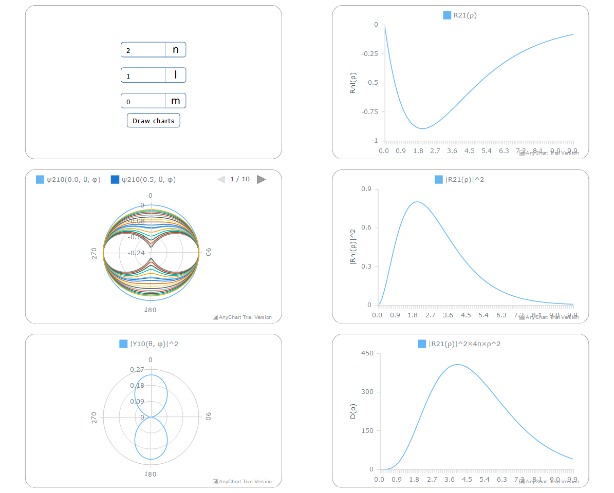
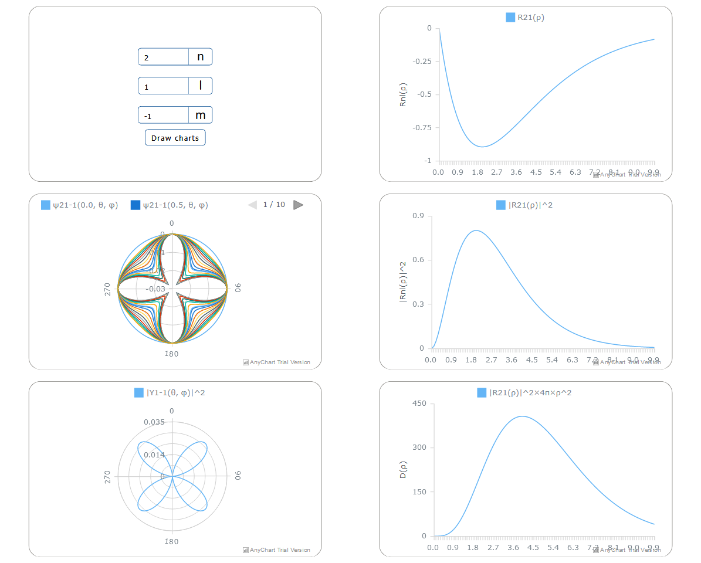
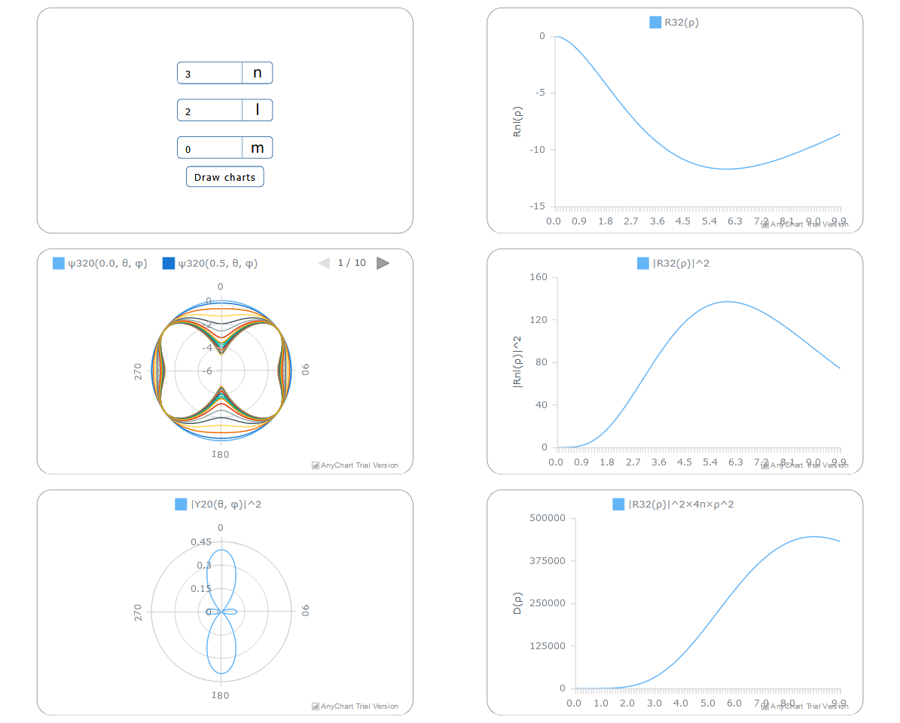

# Квантово-механическая модель атома

#### Константы:
```js
const z = 1; // порядковый номер атома
const h = 1.05e-34; // приведённая постоянная планка
const eq = 1.602176634e-19; // элементарный заряд
const e0 = 8.854187817e-12; // электрическая постоянная
const a = 0.529; // ангстрем
const E0 = 27.07; // эВ
const me = 9.1e-31; // масса электрона кг

const eps = (n) => -E(n) / E0;
const ro = (r) => r / a;
const beta = (n) => Math.sqrt(2 * eps(n));
```

#### Расчет энергии электрона на уровне n
```js
function E(n) {
  return (-(me * (eq ** 4) * (z ** 2)) / ((4 * Math.PI * e0) ** 2 * (2 * n ** 2 * h ** 2))) / eq;
}
```

#### Расчет радиальной функции R:
```js
// Нормировоный коэффициент для радиальной функции
function Anl(n, l) {
  return (1 / factorial(2 * l + 1)) *
    Math.sqrt(factorial(n + l) / (2 * n * factorial(n - l - 1))) *
    (2 * z / n) ** 1.5;
}

// Полиномы Лежандра для радиальной функции
function Lnl(n, l, ro) {
  const ksi = 2 * beta(n) * ro;
  const gamma = n + l;
  const alpha = 2 * l + 1;
  const Lya = nerdamer.diff(nerdamer.diff(`exp(-ksi) * ksi^${gamma}`, 'ksi', gamma).multiply('exp(ksi)'), 'ksi', alpha).evaluate({ 'ksi': ksi }).text();
  return Number(Lya);
}

function Rnl(n, l, r) {
  let ans = {};
  ans.x = ro(r).toFixed(1);
  ans.value = (Anl(n, l) *
    ro(r) ** l *
    Math.E ** (-beta(n) * ro(r)) *
    Lnl(n, l, ro(r)));
  return ans;
}
```

#### Графики R(ρ) и |R^2(ρ)|
```js
function getDataR(n, l) {
  R_data = [];
  for (r = 0; r < 10 * a; r += a / 10) {
    R_data.push(Rnl(n, l, r));
  }
  return R_data;
}

function getDataR2(n, l)  {
  let data = R_data.map(elem => {
    return {
      x: elem.x,
      value: elem.value ** 2
    }
  });
  return data;
}
```

#### График вероятности обнаружения электрона D(ρ) 
```js
function getDataD(n, l) {
  let data = R_data.map(elem => {
    return {
      x: elem.x,
      value: (elem.value ** 2) * r * Math.PI * ro(elem.x) ** 2
    }
  });
  return data;
}
```

#### Расчет форм орбиталей Ylm
```js
function Alm(l, m) {
  return Math.sqrt((factorial(l - Math.abs(m)) * (2 * l + 1)) /
    (factorial(l + Math.abs(m)) * 4 * Math.PI));
}

function Plm(l, m, teta) {
  let x = nerdamer.diff(`(x^2 - 1)^${l}`, 'x', l + m).evaluate({ x: cos(teta) }).evaluate();
  x = Number(x.text());
  return sin(teta) ** Math.abs(m) / (2 ** l * factorial(l)) * x;
}

function Ylm(l, m, teta) {
  let ans = {
    x: teta,
    value: 0
  }
  ans.value = Alm(l, m) * Plm(l, m, teta);
  ans.value **= 2;
  return ans;
}
```

#### График Ylm(θ, φ)
```js
function Ylm_chart(l, m, chart) {
  chart.removeAllSeries();
  Y_data = [];
  for (let angle = 0; angle < 360; angle += 1) {
    Y_data.push(Ylm(l, m, angle));
  }
  let series = chart.line(Y_data);
  series.name(`|Y${l}${m}(θ, φ)|^2`);
  chart.draw();
}
```

#### График волновых функций состояний  Ψ(r, θ, φ)
```js
function Psi_chart(n, l, m, chart) {
  chart.removeAllSeries();
  for (let RIndex = 0; RIndex < R_data.length; RIndex += 5) {
    let data = [];
    for (let YIndex = 0; YIndex < Y_data.length; YIndex += 5) {
      data.push({
        x: Y_data[YIndex].x,
        value: R_data[RIndex].value * Y_data[YIndex].value
      });
    }
    let series = chart.line(data);
    series.name(`ψ${n}${l}${m}(${R_data[RIndex].x}, θ, φ)`);
  }
  chart.draw();
}
```






## Вывод
* Магнитное квантовое число характеризует пространственное расположение атомной орбитали (ориентацию в пространстве орбитального момента импульса электрона)
* Вероятность обнаружения электрона максимальна на расстоянии от ядра, равном радиусу первой боровской орбиты
* Квадрат модуля волновой функции является плотностью вероятности обнаружения системы в данной точке
* Модель атома Бора не применима для многоэлектронных атомов, так как в качестве модели многоэлектронного атома Бор рассмотривал N электронов, вращающихся по одной круговой орбите на равных угловых расстояниях друг от друга. 